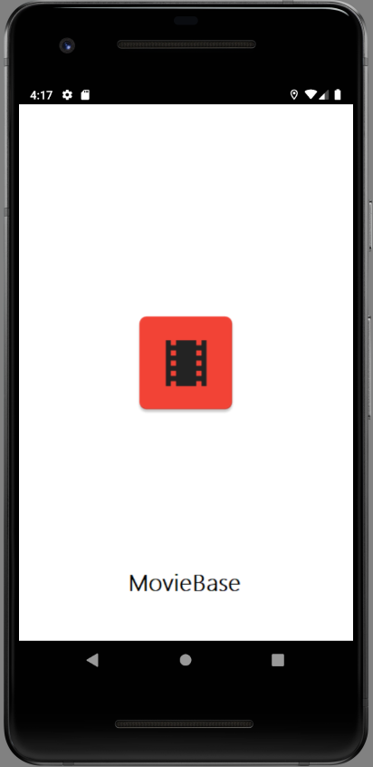
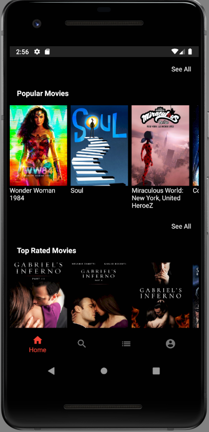
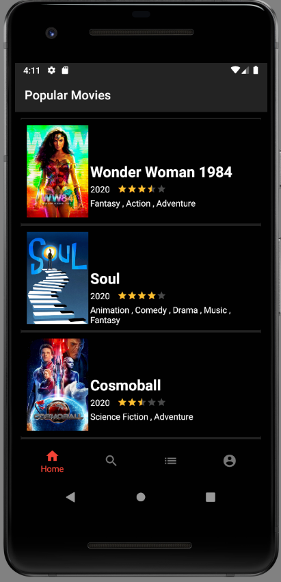
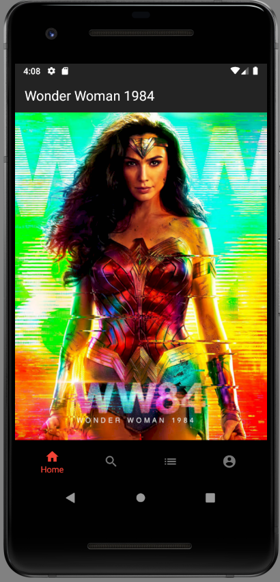
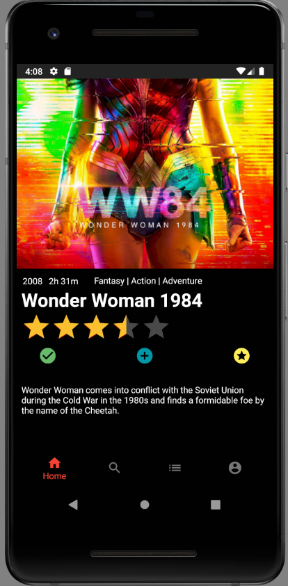
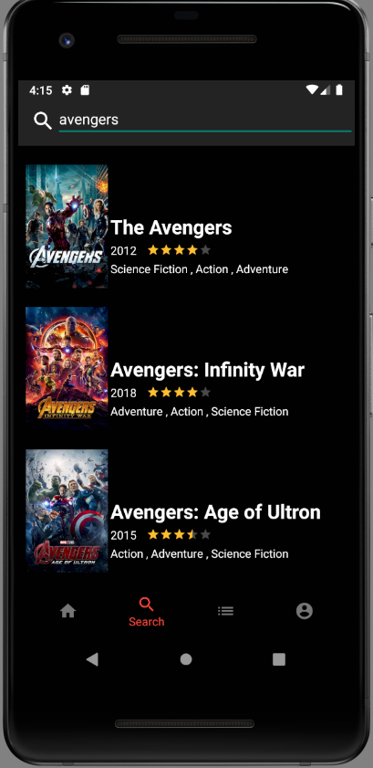
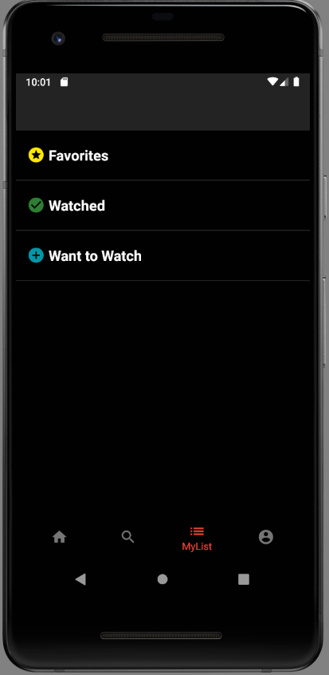
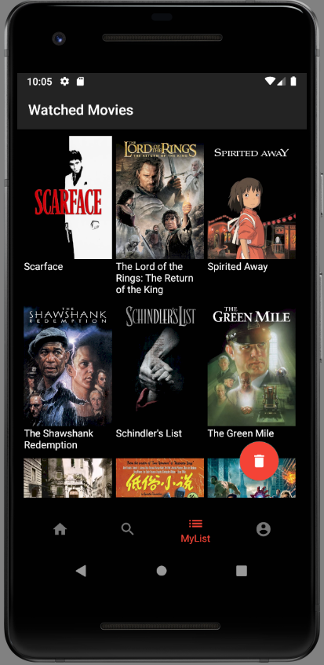
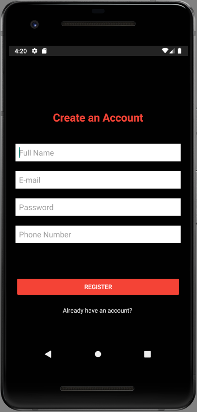
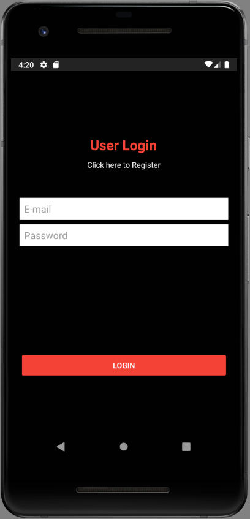

# MovieBase-App🎥
## Android Studio Java Application with MVVM Pattern 
This Android Movie application consumes [TMDb API](https://www.themoviedb.org/documentation/api "The Movie DataBase API") using Retrofit to provide information on popular, top rated, latest and upcoming movies with option of saving ones to favorite, want to watch or watched list. Refactored to MVVM architecture using Architecture Components.

Thanks to this application, it is very easy for a user to see both newly released, popular, upcoming and the most voted movies in the same application. Besides, users can search for the movies with the search button. In addition to all these, there are three lists available to users to save the movies they watched, their favorites and movies they want to watch in lists. So that, those lists can always be accessible even if the device cannot access the network.

---

## 📃Materials
- Dagger2
- RxJava & RxAndroid
- Hilt 
- Retrofit 
- GSON
- Glide
- Room Database
- Navigation Component 
- FireBase Realtime Database

---
## ✨ Screenshots

 

